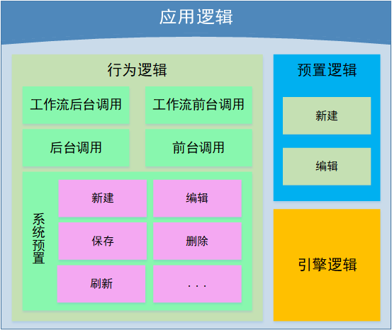

# 应用逻辑简介

app 中，开发人员常常将业务处理内容封装成方法，方便开发和维护。这些被封装的方法，是 app 具体业务数据处理逻辑。不同的逻辑内容，体现了不同功能业务需求和交互设计需求。

iBiz 前端模型，将此类具有公共业务需求的数据处理过程对象化，一同构成了应用逻辑的全部内容。

## 逻辑结构

应用逻辑结构如下：

## 逻辑内容

在 iBiz 前端模型中，逻辑的构成是一个中性的结构模型。通过业务配置，将逻辑放入载体（视图、部件）中后，逻辑业务需求才通过结构代码块得到表现，这些代码块包含了业务逻辑模型全部内容。

因此，iBiz 定义逻辑模型，在具体的 app 中实现业务逻辑。

应用逻辑主要模型对象构成如下：

| 模型名称 | 详情                                                         | 备注 |
| -------- | ------------------------------------------------------------ | ---- |
| 界面逻辑 | [ IPSViewLogic](https://modelapi.ibizlab.cn/#/net/ibizsys/model/view/IPSViewLogic) |      |
| 界面行为 | [ IPSUIAction](https://modelapi.ibizlab.cn/#/net/ibizsys/model/view/IPSUIAction) |      |
| 界面引擎 | [IPSUIEngine](https://modelapi.ibizlab.cn/#/net/ibizsys/model/res/IPSUIEngine) |      |

### 事件

> 注：从模型组成来讲，逻辑事件属于逻辑的一部分，它不具备单独的模型能力，此处将它单独列为一个小节，是为了方便理解。

事件是用逻辑内的一个节点，这个节点提供界面处理入口、数据对象数据处理与数据交互等功能，事件主要分为部件事件、逻辑事件和引擎事件。

#### 部件事件

部件事件是界面处理的入口，iBiz 前端将 app 操作界面事件的业务模型构建在部件逻辑内管理，使部件成为界面处理的入口。

部件的界面行为逻辑包含逻辑事件，其业务逻辑模型在发布后，使其成为统一入口。例如，工具栏部件成员支持的界面行为，表单部件按钮成员支持的界面行为，表格部件操作列支持的界面行为。

#### 逻辑事件

逻辑事件主要处理部件事件，其主要功能是从被指定的容器对象中获取数据，交给后续界面行为使用。

容器对象分别是视图和部件，两者的区别在于是在当前操作的 [控件容器]( https://modelapi.ibizlab.cn/#/net/ibizsys/model/control/IPSControlContainer ) 是否与 [部件数据容器]( https://modelapi.ibizlab.cn/#/net/ibizsys/model/control/IPSControlXDataContainer )  为同一个对象。

如果两个对象一致，则直接从该逻辑事件载体是部件，直接从部件获取数据；如果两个对象不一致，则该部件事件载体是视图，视图需要从对应的部件中获取数据。

界面行为业务模型被使用时，会自动判断逻辑事件指定的数据对象，逻辑事件代码会从数据对象获取数据，完成分发部件事件的过程。

#### 引擎事件

引擎事件是 iBiz 事件中比较特殊的一类，它的定义在 iBiz 界面引擎类型内，使用在 app 核心引擎中。

iBiz 模型预置对应视图的界面引擎类型，这些界面引擎包含的部件指定事件名称，iBiz V2 发布逻辑解析对应的参数名称到部件事件中，成为部件事件，提供给部件与视图作为数据交互的节点。

部件与视图之间做数据交互，部件对外提交数据，视图内对应的部件事件接收数据，再由部件事件转发进入核心引擎，执行预置引擎逻辑。

常见的引擎事件有数据加载完成、数据删除完成和数据保存完成等，它们既包含数据对象的操作状态和数据状态传递。

### 行为逻辑

行为逻辑，是 app 内多数业务界面行为执行单元的终点，它接收引擎事件和逻辑事件传递的数据对象数据、事件参数和数据对象等成员，根据行为数据目标解析数据对象数据，处理事件参数，完成 app 业务逻辑行为功能。

根据行为逻辑的应用场景以及功能，以下几个类别：

- 工作流后台调用：工作流界面行为与后台做数据交互的业务行为逻辑。
- 工作流前台调用：工作流界面行为前台业务行为逻辑，如打开工作流启动视图，工作流操作视图等。
- 后台调用：界面行为与后台做数据交互的业务行为逻辑，改界面行为支持打开视图，获取数据作为目标数据与后台交互。
- 前台调用：面行为前台业务行为逻辑，常见有通过不同的方式打开视图，同时，可以从后台请求需要重定向的目标视图，并通过对应的方式打开。
- 系统预置：系统预置界面行为，是 iBiz 模型预定义的一批公共业务处理逻辑行为，包括保存、编辑、新建、删除和刷新等。

对于部分界面行为执行过程而言，在行为逻辑中，将完成业务模型实现所需的多数内容，结束整个界面行为过。iBiz 模型设计根据常见的业务需求，定义界面行为内执行附加界面行为和预置逻辑两个部分。

附加界面行为会跳过应用逻辑跟事件相关的内容，直接进入行为逻辑，开始相应的业务功能处理。同时，一些界面行为也会在行为逻辑中，进入预置逻辑，完成对应的业务功能处理。

> 注：行为逻辑的载体如果是视图，它可能会进入对应的数据部件中，执行对应的行为，一般以系统预置较多。

### 预置逻辑

预置逻辑是一类特别的应用逻辑，iBiz 模型见多数据视图界面行为中的新建和编辑两个界面行为模型化，成为独立的发布对象，它们同时满足界面行为执行过程和部分引擎逻辑执行的终点。

新建模型和编辑模型都具备对行为目标视图的不同打开模式的支持和关联数据对象数据刷新，此外，编辑模型还支持打开重定向视图。

### 引擎逻辑

引擎逻辑是 app 视图运行的核心，iBiz 模型预置对应视图的界面引擎类型，该引擎主要提供以下功能：

- 视图参数处理：解析视图不同状态下的参数，视图状态包括路由、模态和嵌入三个方面。
- 部件数据加载：引擎根据预置逻辑，传递视图参数给部件，触发部件数据加载逻辑。
- 视图与部件之前的数据交互：
- 处理引擎事件：接收部件提交给视图的数据，由部件事件转发进入引擎中，执行引擎事件对应的逻辑；该逻辑可能在执行后结束，也可能将数据传递给另一个部件，完成部件之间的数据传递功能。

## 执行流程

